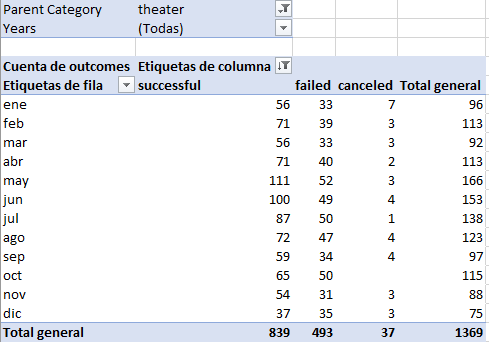
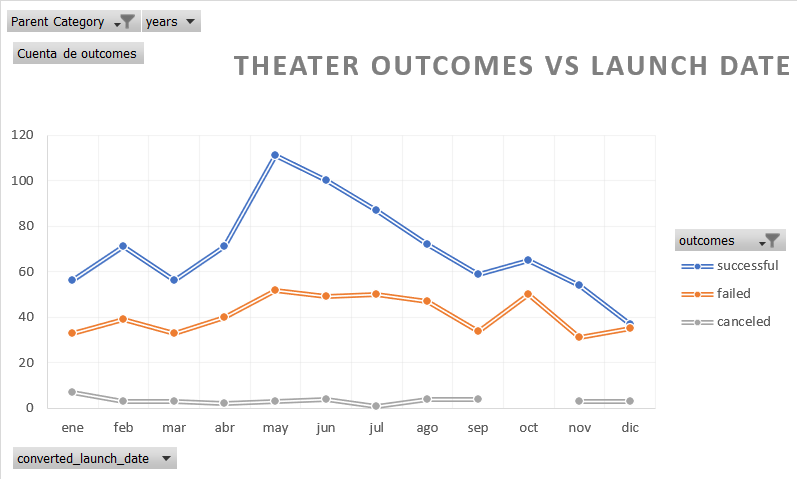
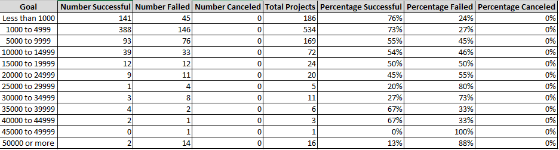
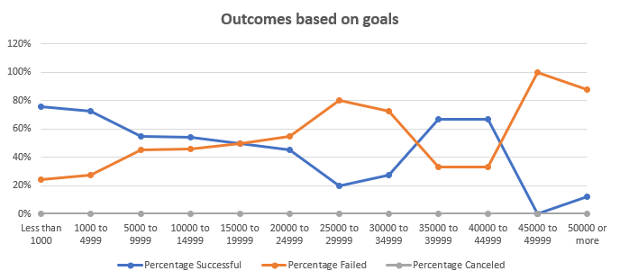
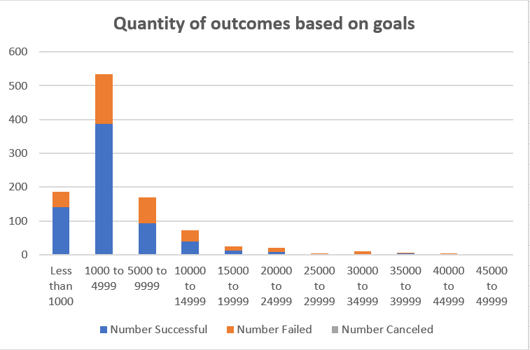
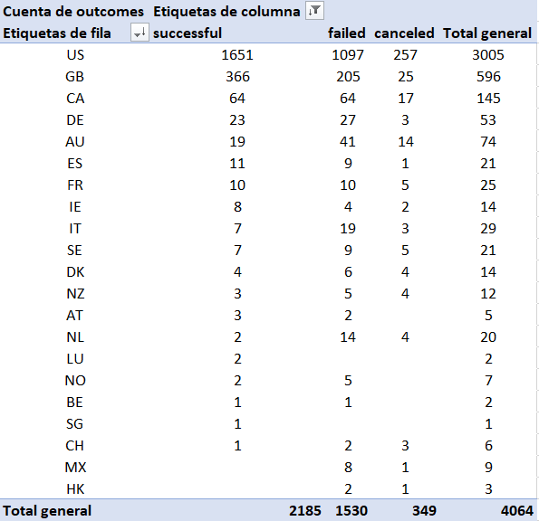
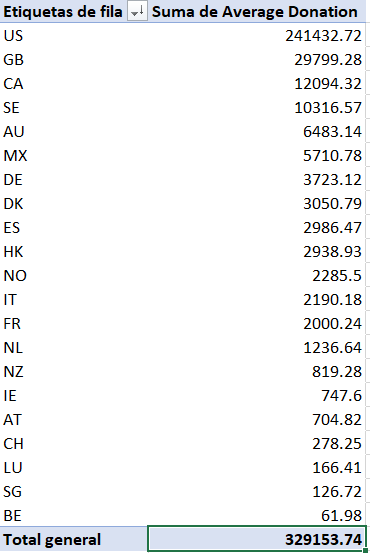

# Analyzing campaings success in relation to their launch dates and funding goals

## Overview of Project 
The kickstarter dataset compiles records of fundraising campings and their results. It counts with  4113 records of projects from different categories/subcategories and we'll be focusing on the category 'theater' and subcategory 'plays'.
The dataset was analyzed in order to discover insights regarding the success or failure for theater fundraising campaings focusing on the trends of launch dates and funding goals.

## Purpose
Analyze the results for different campaings, focusing on plays to discover insights to know if they succeded or not regarding their launch date and funding goals.

## Analysis and Challenges
The first task was to analyze the trend regarding the launch date and how many campaings were successful, canceled or failed.
The dataset needed to be ready for it's use and some columnes were added. The Category and Subcategory column was separated into Parent Category and Subcategory using the tool "Text to columns" and specifying the delimiter as "/" .
Another challenge was to convert from UNIX timestamp to short date, this was able because of the formula (((Time)/60)/60)24)+Date(1970,1,1). Finally a column with "years" was added to the kickstarter sheet to obtain another source of data and to be able and use it in the analysis. 
A pivot table was created using as column 'outcomes', rows 'date created conversion', values 'outcomes' and filters 'years', 'parent category'. By doing this the table was shown with years instead of months, so in the rows section the 'quartiles' and 'years' were dropped in order to get the months visibles in the pivot table.
A filter was applied to the outcomes just to show 'canceled', 'failed' and 'successful' campaings and then we sorted in descending order. After this, the parent category was filtered to show only 'theater' since we're focusing on this category and finally the results were shown.

> **Table1. Outcomes table for 'theather' category**

Finally a dinamyc graph was displayed consdering in the x-axis the months and in the y-axis the amount of outcomes.

> **Graph1. Theater outcomes vs launch date**

The table shows that 61% of the campings were succesful vs the 36% that failed. The graph1 shows that the best months for launched campaings were May, June and July. It's clear that neither the begining or end of year is a good choice to launch a fundraising campaing.

The second task was to analyze the percentage of outcomes for campaings vs the fundraise goal.
A goal interval was set to summarize the information. The columns for the amount of successful, failed, canceled and total of projects were stablished as well as those of their respective percentages. The countifs() function was used to comply with the following criteria: amount of goal raised, outcome (successful,canceled or failed) and the subcategory 'plays'. After performing the previous operation, the percentages were obtained. The results are shown below.

> **Table2. Percentages of outcomes based on goals**

Since we want to understand the trend of outcomes based on goals a graph was displayed considering in the x-axis the goal and the y-axis the percentages of outcomes.

> **Graph2. Outcomes based on goals**

With the graph2 we can have a better understanding of the trends.

### Analysis of Outcomes Based on Launch Date

* From January to May the interest in projects related to theater increases, being May the month with the highest quantity of successful projects.
* From May to December the trend regarding successful campaigns is downward, while from May to August the quantity of failed projects keeps the same tendency.

### Analysis of Outcomes Based on Goals

* The trend shows that as the goal increases, the percentage of successful projects decreases. For goals of $25,000 to $39,999 we can see an increment of 40% on successful campaings, this is related due to the low amount of campaings within that range of budgets and therefore has an impact when one of them is successful.

### Challenges and Difficulties Encountered

* Splitting the Category and Subcategory column into two columns
* Converting from UNIX timestamp to short date
* A possible difficulty could be if we only had years instead of shortdates (dd/mm/yyyy), the analysis wouldn't be as precise as the actual one because we wouldn't have the information regarding the best or worst months to launch a fundraising campaing. 

## Results

**What are two conclusions you can draw about the Outcomes based on Launch Date?**
* Based on the results the suggested month to launch a campaing is May.
* From May to August the amount of successful campaigns decreases drastically while the amount of failed projects are almost the same. Therefore there are more chances of failure during these months.

**What can you conclude about the Outcomes based on Goals?**
* The higher the amount of goal needed for the campaing, the higher the percentage of projects failed.

**What are some limitations of this dataset?**
* It's only focusing on quantity of money, but there could be another reasons for the failure or success of campaings. An example could be the popularity of the project or if it has an altruist purpose.

**What are some other possible tables and/or graphs that we could create?**
* A graph that would help to understand better the graph2 showed early is the Quantity of outcomes based on goals as shown below.
 

* A pivot table that shows the most successful countries regarding fundraising campaings.
 

* A table that shows the average donation per country.

